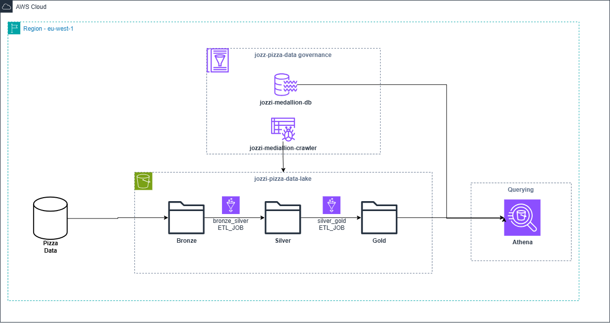

# Medallion Architecture on AWS (Terraform + Glue + Athena)

This project implements a **Bronze → Silver → Gold** data lake on AWS using **Terraform**, **AWS Glue**, and **Amazon Athena**.

## Layers
- **Bronze**: Raw landing zone (no transforms)
- **Silver**: Cleaned, validated, conformed datasets (Parquet + partitions)
- **Gold**: Curated aggregates for BI/ML

## Deploy (dev)
1. Edit `environments/dev/backend.tf` to configure your remote state (or comment the block to use local state).
2. Edit `environments/dev/terraform.tfvars` with your region/project.
3. `./scripts/init.sh` → `./scripts/plan.sh` → `./scripts/apply.sh`
4. Upload Glue scripts to `s3://{project}-{env}-lake/scripts/` (created by the S3 module).
5. Run Glue crawlers for Bronze/Silver/Gold, then trigger the jobs.

## Operate
- Use **AWS Glue Crawlers** to register tables in the Glue **Data Catalog**.
- Trigger jobs on demand or via **Step Functions**/**EventBridge** + **Lambda** (module stub provided).
- Query curated data using **Athena**.

## Security & Governance
- Tighten IAM policies to bucket/table ARNs (defaults are permissive for quick start).
- Consider **Lake Formation** for fine-grained access control.
- For ACID tables and easier schema evolution, evaluate **Apache Iceberg** with Glue Catalog.

## Structure
See repository tree in the project root for details.
